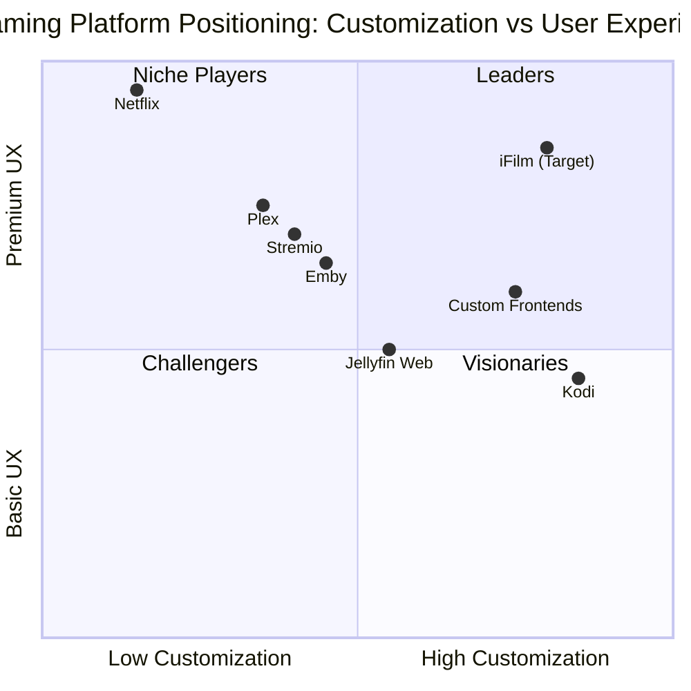

# Product Requirements Document (PRD)
# iFilm - Jellyfin-Based Streaming Platform

## Document Information
- **Project Name**: ifilm
- **Document Version**: 1.0
- **Last Updated**: 2025-12-29
- **Language**: English
- **Programming Language**: React.js, TypeScript, Node.js, Tailwind CSS

---

## 1. Product Overview

### 1.1 Original Requirements
Build a Netflix-style streaming website connected to Jellyfin. Movies are stored in Jellyfin and streamed through the website. This is NOT a Jellyfin theme or iframe embed - this is a custom Netflix-like platform branded as iFilm.

### 1.2 Product Goals
1. **Seamless Streaming Experience**: Deliver a professional, Netflix-quality streaming platform that provides smooth playback, adaptive streaming, and comprehensive media management
2. **Secure Jellyfin Integration**: Create a robust backend proxy system that securely connects to Jellyfin API while protecting sensitive credentials and ensuring reliable media delivery
3. **Intuitive User Experience**: Design an elegant, user-friendly interface that enables easy content discovery, personalized recommendations, and seamless navigation across all devices

### 1.3 User Stories
1. **As a viewer**, I want to browse movies and TV shows in a Netflix-style interface so that I can easily discover and watch content from my Jellyfin library
2. **As a viewer**, I want to search for specific titles, track my watch history, and save favorites so that I can quickly access content I enjoy
3. **As a viewer**, I want a full-featured video player with subtitle support, quality selection, and playback controls so that I can enjoy content with optimal viewing experience
4. **As an administrator**, I want to connect my Jellyfin server and manage library visibility so that I can control what content is available to users
5. **As an administrator**, I want to manage user accounts and permissions so that I can control access to the platform and monitor usage

### 1.4 Competitive Analysis

#### Competitor 1: Netflix
- **Pros**: Industry-leading UI/UX, excellent content discovery, robust recommendation engine, seamless multi-device experience
- **Cons**: Closed ecosystem, subscription-based only, no self-hosted option, limited customization

#### Competitor 2: Plex
- **Pros**: Self-hosted media server, good mobile apps, transcoding support, user management
- **Cons**: Requires Plex Pass for advanced features, less customizable UI, mixed free/premium model

#### Competitor 3: Emby
- **Pros**: Self-hosted solution, good API documentation, plugin system, live TV support
- **Cons**: Premium features require subscription, smaller community, less modern UI

#### Competitor 4: Jellyfin Web Client
- **Pros**: Open-source, free, direct Jellyfin integration, active community
- **Cons**: Basic UI design, limited customization, not branded/white-label friendly

#### Competitor 5: Stremio
- **Pros**: Clean interface, add-on system, cross-platform, torrent streaming
- **Cons**: Focuses on third-party content, less suitable for personal libraries, limited customization

#### Competitor 6: Kodi
- **Pros**: Highly customizable, extensive plugin ecosystem, supports multiple sources
- **Cons**: Complex setup, outdated UI paradigm, primarily desktop-focused

#### Competitor 7: Streamio Custom Frontends
- **Pros**: Custom branding possible, API-based integration, modern tech stacks
- **Cons**: Requires development expertise, maintenance overhead, security considerations

### 1.5 Competitive Quadrant Chart



---

## 2. Technical Specifications

### 2.1 Technology Stack

#### Frontend
- **Framework**: React.js 18+ with TypeScript
- **Styling**: Tailwind CSS 3+
- **State Management**: React Context API / Redux Toolkit
- **Routing**: React Router v6
- **HTTP Client**: Axios
- **Video Player**: Video.js or Plyr with HLS.js support
- **UI Components**: Headless UI / Radix UI with custom Tailwind styling

#### Backend
- **Runtime**: Node.js 18+ LTS
- **Framework**: Express.js
- **Language**: TypeScript
- **Authentication**: JWT (JSON Web Tokens)
- **API Documentation**: Swagger/OpenAPI
- **Security**: Helmet.js, CORS, Rate Limiting
- **Validation**: Zod or Joi

#### Database
- **Primary**: PostgreSQL or MongoDB
- **Caching**: Redis (for session management and API response caching)

#### Deployment & Infrastructure
- **Containerization**: Docker & Docker Compose
- **Reverse Proxy**: Nginx
- **SSL/TLS**: Let's Encrypt
- **Environment Management**: dotenv

### 2.2 Requirements Analysis

#### Core Requirements
1. **Jellyfin Integration**: Secure REST API integration without exposing credentials to frontend
2. **Streaming Infrastructure**: HLS-based adaptive streaming with subtitle support
3. **User Management**: Authentication, authorization, and user profile management
4. **Content Discovery**: Search, filtering, categorization, and recommendation features
5. **Admin Controls**: Server configuration, library management, and user administration
6. **Security**: API key protection, secure token handling, and request validation

#### Technical Constraints
1. **Must NOT** expose Jellyfin API keys or credentials to frontend
2. **Must** use backend proxy for all Jellyfin API requests
3. **Must** support HLS streaming protocol for adaptive bitrate
4. **Must** handle token expiration and refresh mechanisms
5. **Should** support responsive design for mobile, tablet, and desktop
6. **Should** implement caching to reduce Jellyfin API load
7. **May** support offline viewing capabilities in future versions

### 2.3 Requirements Pool

#### P0 (Must-Have) - Core Features
| Requirement ID | Description | Priority |
|---------------|-------------|----------|
| REQ-001 | Jellyfin REST API integration via backend proxy | P0 |
| REQ-002 | User authentication and authorization system | P0 |
| REQ-003 | Netflix-style homepage with content carousels | P0 |
| REQ-004 | Movie/series detail pages with metadata display | P0 |
| REQ-005 | HTML5 video player with HLS streaming support | P0 |
| REQ-006 | Subtitle support (multiple languages, toggling) | P0 |
| REQ-007 | Search functionality (titles, actors, genres) | P0 |
| REQ-008 | Watch history tracking per user | P0 |
| REQ-009 | Favorites/watchlist management | P0 |
| REQ-010 | Admin panel for Jellyfin server connection | P0 |
| REQ-011 | Library visibility management | P0 |
| REQ-012 | User management (create, edit, delete users) | P0 |
| REQ-013 | Secure API key storage and handling | P0 |
| REQ-014 | Token expiration and refresh mechanism | P0 |
| REQ-015 | Responsive design (mobile, tablet, desktop) | P0 |

#### P1 (Should-Have) - Enhanced Features
| Requirement ID | Description | Priority |
|---------------|-------------|----------|
| REQ-016 | Continue watching section with progress tracking | P1 |
| REQ-017 | Quality selection (720p, 1080p, 4K) | P1 |
| REQ-018 | Playback speed control | P1 |
| REQ-019 | Episode auto-play for TV series | P1 |
| REQ-020 | Content filtering by genre, year, rating | P1 |
| REQ-021 | User profile avatars and preferences | P1 |
| REQ-022 | Admin dashboard with usage statistics | P1 |
| REQ-023 | Content recommendation engine | P1 |
| REQ-024 | Multi-language interface support | P1 |
| REQ-025 | Keyboard shortcuts for video player | P1 |

#### P2 (Nice-to-Have) - Future Enhancements
| Requirement ID | Description | Priority |
|---------------|-------------|----------|
| REQ-026 | Social features (ratings, reviews, sharing) | P2 |
| REQ-027 | Parental controls and content ratings | P2 |
| REQ-028 | Download for offline viewing | P2 |
| REQ-029 | Chromecast/AirPlay support | P2 |
| REQ-030 | Watch party feature (synchronized viewing) | P2 |
| REQ-031 | Advanced analytics and viewing insights | P2 |
| REQ-032 | Custom playlists creation | P2 |
| REQ-033 | Integration with external subtitle services | P2 |
| REQ-034 | Mobile apps (iOS/Android) | P2 |
| REQ-035 | Voice search capability | P2 |

---

## 3. Feature Specifications

### 3.1 Netflix-Style Homepage

#### 3.1.1 Layout Structure
- **Hero Banner**: Featured content with large backdrop image, title, description, and primary CTA (Play/More Info)
- **Content Rows**: Multiple horizontal scrollable carousels organized by categories
- **Navigation Bar**: Fixed top navigation with logo, search, user menu
- **Footer**: Links to admin panel, about, help, terms

#### 3.1.2 Content Categories
1. **Continue Watching**: Resume partially watched content
2. **Trending Now**: Popular content based on view counts
3. **Recently Added**: Newest additions to library
4. **Movies**: All available movies
5. **TV Shows**: All available series
6. **Genre-Based Rows**: Action, Comedy, Drama, Sci-Fi, etc.
7. **Recommended for You**: Personalized suggestions

#### 3.1.3 Carousel Behavior
- Horizontal scroll with smooth animation
- Show 4-6 items per viewport (responsive)
- Hover effect: Scale up item, show quick info overlay
- Click: Navigate to detail page
- Lazy loading for performance optimization

#### 3.1.4 Technical Requirements
- **Must** fetch content from Jellyfin API via backend proxy
- **Must** cache carousel data for 5-10 minutes
- **Must** implement infinite scroll or pagination for large libraries
- **Should** preload hero banner images
- **Should** support skeleton loading states

### 3.2 Movie/Series Detail Pages

#### 3.2.1 Page Layout
- **Backdrop Image**: Full-width background with gradient overlay
- **Poster**: Movie/series poster image
- **Title & Metadata**: Title, year, rating, duration, genres
- **Description**: Full synopsis
- **Action Buttons**: Play, Add to Favorites, Share
- **Cast & Crew**: Actor names with profile images
- **Similar Content**: Recommendations based on current item
- **Episodes List** (for TV series): Season selector, episode grid

#### 3.2.2 Metadata Display
- Title (original and localized if available)
- Release year
- Content rating (PG, PG-13, R, etc.)
- Runtime/duration
- Genres (tags)
- Director and main cast
- IMDb/TMDB ratings (if available in Jellyfin)
- Available audio tracks and subtitles

#### 3.2.3 Episode Management (TV Series)
- Season dropdown selector
- Episode grid/list view
- Episode thumbnails, titles, descriptions
- Episode duration and air date
- Watch progress indicator per episode
- Click episode to start playback

#### 3.2.4 Technical Requirements
- **Must** fetch detailed metadata from Jellyfin API
- **Must** generate secure stream URLs through backend
- **Must** track user interactions (favorites, watch history)
- **Should** implement breadcrumb navigation
- **Should** support deep linking to specific episodes

### 3.3 Video Player

#### 3.3.1 Player Features
- **Playback Controls**: Play/pause, seek bar, volume control
- **Quality Selection**: Automatic and manual quality switching
- **Subtitle Controls**: Enable/disable, language selection, styling options
- **Audio Track Selection**: Multiple audio language support
- **Playback Speed**: 0.5x, 0.75x, 1x, 1.25x, 1.5x, 2x
- **Fullscreen Mode**: Native fullscreen with exit button
- **Picture-in-Picture**: Minimize player while browsing
- **Skip Intro/Credits**: Quick skip buttons (if metadata available)
- **Next Episode**: Auto-play countdown for series

#### 3.3.2 Player UI Elements
- Large centered play/pause button
- Bottom control bar (auto-hide after 3 seconds)
- Progress bar with thumbnail preview on hover
- Time display (current/total)
- Volume slider
- Settings gear icon (quality, subtitles, speed)
- Fullscreen toggle
- Back button (return to detail page)

#### 3.3.3 Keyboard Shortcuts
- Space: Play/Pause
- Arrow Left/Right: Seek backward/forward 10 seconds
- Arrow Up/Down: Volume up/down
- F: Toggle fullscreen
- M: Mute/unmute
- C: Toggle subtitles
- Escape: Exit fullscreen

#### 3.3.4 HLS Streaming Implementation
- **Must** use HLS.js library for adaptive streaming
- **Must** support automatic bitrate switching based on bandwidth
- **Must** handle stream errors gracefully with retry logic
- **Should** implement buffer management for smooth playback
- **Should** support seeking in transcoded streams

#### 3.3.5 Subtitle Support
- **Must** support VTT, SRT subtitle formats
- **Must** allow subtitle styling (font size, color, background)
- **Must** support multiple subtitle tracks
- **Should** implement subtitle synchronization controls
- **May** support external subtitle file upload

#### 3.3.6 Technical Requirements
- **Must** request secure stream URLs from backend
- **Must** implement token refresh before expiration
- **Must** track playback progress and save to database
- **Must** handle network interruptions gracefully
- **Should** implement adaptive bitrate logic
- **Should** preload next episode for series

### 3.4 Search Functionality

#### 3.4.1 Search Interface
- Prominent search icon in navigation bar
- Click to expand search input field
- Real-time search suggestions as user types
- Search results page with filters

#### 3.4.2 Search Capabilities
- **Title Search**: Match movie/series titles
- **Actor Search**: Find content by cast members
- **Director Search**: Find content by director
- **Genre Search**: Filter by genre tags
- **Year Search**: Filter by release year
- **Full-Text Search**: Search in descriptions

#### 3.4.3 Search Results Display
- Grid layout of matching content
- Show poster, title, year, rating
- Highlight search term in results
- Sort options (relevance, date, rating, title)
- Filter sidebar (genre, year, type)

#### 3.4.4 Technical Requirements
- **Must** implement debounced search (300ms delay)
- **Must** search via backend API (Jellyfin search endpoint)
- **Must** cache popular search queries
- **Should** implement search history per user
- **Should** support fuzzy matching for typos

### 3.5 Watch History

#### 3.5.1 History Tracking
- Automatically record all content viewed
- Track playback position for resume functionality
- Store timestamp of last watch
- Track completion status (percentage watched)

#### 3.5.2 History Display
- Dedicated "Watch History" page
- Chronological list of watched content
- Show thumbnail, title, watch date, progress
- Option to remove items from history
- Option to clear all history

#### 3.5.3 Continue Watching Feature
- Display on homepage as top row
- Show only partially watched content (5%-90% complete)
- Resume from exact playback position
- Remove from "Continue Watching" when completed

#### 3.5.4 Technical Requirements
- **Must** store watch history in database per user
- **Must** update playback position every 10 seconds
- **Must** sync watch history across devices
- **Should** implement privacy controls (disable tracking)
- **Should** set retention policy (e.g., 90 days)

### 3.6 Favorites/Watchlist

#### 3.6.1 Favorites Management
- Add/remove content to favorites from detail page
- Heart icon indicator (filled when favorited)
- Dedicated "My Favorites" page
- Grid display of favorited content

#### 3.6.2 Watchlist Features
- Separate watchlist for "plan to watch" content
- Add from detail page or search results
- Organize by custom lists (optional P2 feature)
- Notification when new episodes available (P2)

#### 3.6.3 UI Interactions
- One-click add/remove toggle
- Visual feedback on action (toast notification)
- Sync across all user sessions
- Quick access from user menu dropdown

#### 3.6.4 Technical Requirements
- **Must** store favorites/watchlist in database per user
- **Must** provide API endpoints for CRUD operations
- **Must** validate user ownership before modifications
- **Should** implement bulk operations (add/remove multiple)
- **Should** support export/import functionality

---

## 4. Jellyfin REST API Integration

### 4.1 API Architecture

#### 4.1.1 Backend Proxy Pattern
```
[Frontend] <--> [iFilm Backend] <--> [Jellyfin Server]
```

- **All** Jellyfin API requests must go through iFilm backend
- Frontend never directly communicates with Jellyfin
- Backend handles authentication, request proxying, response transformation

#### 4.1.2 API Key Management
- Store Jellyfin API key in backend environment variables
- Never expose API key to frontend
- Use separate API keys per environment (dev, staging, prod)
- Implement key rotation mechanism

### 4.2 Core API Endpoints to Integrate

#### 4.2.1 Authentication
- **POST** `/Users/AuthenticateByName`: Authenticate Jellyfin user
- **POST** `/Users/{userId}/Authenticate`: Validate user session
- **DELETE** `/Sessions/Logout`: Logout user

#### 4.2.2 Content Discovery
- **GET** `/Items`: Fetch media items with filters
- **GET** `/Items/{itemId}`: Get detailed item information
- **GET** `/Users/{userId}/Items`: Get user-specific items
- **GET** `/Users/{userId}/Items/Latest`: Get recently added items
- **GET** `/Users/{userId}/Items/Resume`: Get resumable items
- **GET** `/Shows/{seriesId}/Episodes`: Get episodes for series
- **GET** `/Shows/{seriesId}/Seasons`: Get seasons for series

#### 4.2.3 Metadata
- **GET** `/Items/{itemId}/Images`: Fetch item images
- **GET** `/Items/{itemId}/RemoteImages`: Get remote image URLs
- **GET** `/Genres`: Get all available genres
- **GET** `/Studios`: Get all studios
- **GET** `/Persons/{personId}`: Get actor/director information

#### 4.2.4 Streaming
- **GET** `/Videos/{itemId}/stream`: Get direct stream URL
- **GET** `/Videos/{itemId}/master.m3u8`: Get HLS master playlist
- **GET** `/Videos/{itemId}/hls/{playlistId}/stream.m3u8`: Get HLS variant playlist
- **GET** `/Videos/{itemId}/Subtitles/{streamIndex}/Stream`: Get subtitle stream

#### 4.2.5 User Data
- **POST** `/Users/{userId}/PlayedItems/{itemId}`: Mark item as played
- **DELETE** `/Users/{userId}/PlayedItems/{itemId}`: Mark item as unplayed
- **POST** `/Users/{userId}/FavoriteItems/{itemId}`: Add to favorites
- **DELETE** `/Users/{userId}/FavoriteItems/{itemId}`: Remove from favorites
- **POST** `/Users/{userId}/PlayingItems/{itemId}`: Report playback started
- **POST** `/Users/{userId}/PlayingItems/{itemId}/Progress`: Report playback progress
- **DELETE** `/Users/{userId}/PlayingItems/{itemId}`: Report playback stopped

#### 4.2.6 Search
- **GET** `/Search/Hints`: Get search suggestions
- **GET** `/Items`: Search with query parameter

### 4.3 Secure Stream URL Generation

#### 4.3.1 Stream URL Structure
```
https://jellyfin-server.com/Videos/{itemId}/stream?
  api_key={API_KEY}&
  userId={USER_ID}&
  mediaSourceId={MEDIA_SOURCE_ID}&
  static=true
```

#### 4.3.2 Backend Stream Proxy Flow
1. Frontend requests stream URL from iFilm backend
2. Backend validates user session and permissions
3. Backend generates temporary access token (expires in 1-2 hours)
4. Backend constructs Jellyfin stream URL with API key
5. Backend returns proxied stream URL to frontend
6. Frontend uses proxied URL for video player
7. Backend validates token on each stream request

#### 4.3.3 HLS Streaming Flow
1. Request master playlist from backend
2. Backend fetches from Jellyfin, injects authentication
3. Return modified playlist with proxied segment URLs
4. Video player requests segments through backend proxy
5. Backend validates token and forwards to Jellyfin
6. Stream video segments to frontend

#### 4.3.4 Security Requirements
- **Must** implement token-based stream authentication
- **Must** set token expiration (1-2 hours)
- **Must** validate user permissions before generating URLs
- **Must** log all stream access attempts
- **Should** implement rate limiting per user
- **Should** detect and block unauthorized sharing

### 4.4 Response Caching Strategy

#### 4.4.1 Cache Layers
- **Redis Cache**: Store frequently accessed API responses
- **In-Memory Cache**: Store static data (genres, studios)
- **CDN Cache**: Cache images and static assets

#### 4.4.2 Cache TTL (Time-To-Live)
- Library items: 5 minutes
- Item details: 10 minutes
- Images: 24 hours
- User data (favorites, history): No cache (always fresh)
- Search results: 2 minutes

#### 4.4.3 Cache Invalidation
- Manual invalidation via admin panel
- Automatic invalidation on content updates
- Time-based expiration
- Cache warming for popular content

### 4.5 Error Handling

#### 4.5.1 Common Error Scenarios
- Jellyfin server unreachable
- Invalid API key
- User not authorized
- Content not found
- Stream unavailable
- Network timeout

#### 4.5.2 Error Response Format
```json
{
  "success": false,
  "error": {
    "code": "JELLYFIN_UNREACHABLE",
    "message": "Unable to connect to Jellyfin server",
    "details": "Connection timeout after 5000ms"
  }
}
```

#### 4.5.3 Frontend Error Handling
- Display user-friendly error messages
- Implement retry logic with exponential backoff
- Provide fallback UI for missing content
- Log errors for debugging

---

## 5. Admin Panel

### 5.1 Admin Authentication

#### 5.1.1 Admin User Management
- Separate admin role in database
- Admin-only routes protected by middleware
- Multi-factor authentication for admin access (P1)
- Admin activity logging

#### 5.1.2 Access Control
- Role-based access control (RBAC)
- Permissions: Super Admin, Admin, Moderator
- Granular permissions for specific actions
- Session timeout for admin users (30 minutes)

### 5.2 Jellyfin Server Connection

#### 5.2.1 Server Configuration Interface
- **Server URL**: Input field for Jellyfin server address
- **API Key**: Secure input for Jellyfin API key
- **Test Connection**: Button to verify connectivity
- **Connection Status**: Visual indicator (connected/disconnected)
- **Server Info**: Display Jellyfin version, libraries available

#### 5.2.2 Configuration Form Fields
```
- Jellyfin Server URL: https://jellyfin.example.com
- API Key: ********************************
- Connection Timeout: 5000ms (default)
- Enable SSL Verification: Yes/No toggle
- Proxy Settings: Optional proxy configuration
```

#### 5.2.3 Connection Testing
- Validate URL format
- Test API key authentication
- Fetch server information
- Check library access
- Display connection latency
- Show error details if connection fails

#### 5.2.4 Technical Requirements
- **Must** encrypt API key before storing in database
- **Must** validate server URL format
- **Must** test connection before saving
- **Must** support HTTPS connections
- **Should** implement connection health monitoring
- **Should** alert admin on connection failures

### 5.3 Library Management

#### 5.3.1 Library Discovery
- Automatically fetch all libraries from Jellyfin
- Display library name, type (Movies/TV Shows), item count
- Show library path and last scan date

#### 5.3.2 Library Visibility Controls
- Toggle visibility per library (show/hide on frontend)
- Set library display order
- Assign libraries to user groups (P1)
- Configure library-specific settings

#### 5.3.3 Library Sync
- Manual sync button to refresh library data
- Automatic sync schedule (hourly, daily)
- Display sync status and last sync time
- Show sync errors and warnings

#### 5.3.4 Content Filtering (P1)
- Filter content by rating (hide adult content)
- Filter by genre (hide specific genres)
- Filter by year (hide old content)
- Whitelist/blacklist specific items

#### 5.3.5 Technical Requirements
- **Must** fetch libraries via Jellyfin API
- **Must** store visibility settings in database
- **Must** apply filters on backend before serving to frontend
- **Should** implement batch operations
- **Should** provide preview before applying changes

### 5.4 User Management

#### 5.4.1 User List View
- Table display: Username, Email, Role, Status, Created Date
- Search and filter users
- Sort by various columns
- Pagination for large user bases

#### 5.4.2 User Creation
- Create new user form
- Fields: Username, Email, Password, Role
- Email verification option (P1)
- Welcome email notification (P1)

#### 5.4.3 User Editing
- Edit user profile information
- Change user role/permissions
- Reset user password
- Enable/disable user account
- View user activity log

#### 5.4.4 User Deletion
- Soft delete (mark as inactive)
- Hard delete (remove from database)
- Confirmation dialog with warning
- Option to delete user data (history, favorites)

#### 5.4.5 User Permissions
- Assign roles: Admin, User, Guest
- Custom permission sets (P1)
- Library access restrictions
- Feature access control (download, sharing)

#### 5.4.6 User Activity Monitoring
- View user login history
- Track watch activity
- Monitor bandwidth usage (P1)
- Generate user reports (P1)

#### 5.4.7 Technical Requirements
- **Must** implement secure password hashing (bcrypt)
- **Must** validate email format
- **Must** prevent duplicate usernames/emails
- **Must** log all admin actions on users
- **Should** implement user invitation system
- **Should** support bulk user operations

### 5.5 Dashboard & Analytics (P1)

#### 5.5.1 Dashboard Overview
- Total users count
- Active users (last 7 days)
- Total content items
- Storage usage
- Bandwidth usage
- Popular content chart

#### 5.5.2 Analytics Metrics
- Daily/weekly/monthly active users
- Most watched content
- Peak usage times
- Average watch duration
- Content completion rates
- Search trends

#### 5.5.3 Reports Generation (P1)
- User activity reports
- Content popularity reports
- System health reports
- Export reports as CSV/PDF

### 5.6 System Settings

#### 5.6.1 General Settings
- Site name and branding
- Default language
- Timezone configuration
- Date/time format

#### 5.6.2 Feature Toggles
- Enable/disable user registration
- Enable/disable search
- Enable/disable downloads (P2)
- Enable/disable social features (P2)

#### 5.6.3 Email Configuration (P1)
- SMTP server settings
- Email templates
- Notification preferences

#### 5.6.4 Security Settings
- Session timeout duration
- Password complexity requirements
- Rate limiting configuration
- IP whitelist/blacklist

---

## 6. Security Requirements

### 6.1 API Key Protection

#### 6.1.1 Storage Security
- **Must** store Jellyfin API key in environment variables (`.env` file)
- **Must** encrypt API key in database using AES-256 encryption
- **Must** never log API keys in application logs
- **Must** exclude `.env` from version control (`.gitignore`)

#### 6.1.2 Access Control
- **Must** restrict API key access to backend services only
- **Must** implement role-based access for admin configuration
- **Must** audit all API key usage and changes
- **Should** rotate API keys periodically (every 90 days)
- **Should** support multiple API keys for different environments

#### 6.1.3 Key Rotation Process
1. Generate new API key in Jellyfin
2. Update key in admin panel
3. Test connection with new key
4. Deprecate old key after grace period
5. Revoke old key in Jellyfin

### 6.2 Backend Proxy Security

#### 6.2.1 Request Validation
- **Must** validate all incoming requests
- **Must** sanitize user inputs to prevent injection attacks
- **Must** implement request size limits
- **Must** validate content types
- **Should** implement request signing for critical operations

#### 6.2.2 Authentication & Authorization
- **Must** require valid JWT token for all API requests
- **Must** validate token signature and expiration
- **Must** check user permissions before proxying to Jellyfin
- **Must** implement refresh token mechanism
- **Should** support OAuth2 for third-party integrations (P2)

#### 6.2.3 Rate Limiting
- **Must** implement rate limiting per user (e.g., 100 requests/minute)
- **Must** implement rate limiting per IP address
- **Must** return 429 status code when limit exceeded
- **Should** implement adaptive rate limiting based on user tier
- **Should** whitelist admin IPs from rate limiting

#### 6.2.4 CORS Configuration
- **Must** configure CORS to allow only trusted origins
- **Must** restrict allowed HTTP methods
- **Must** validate Origin header
- **Should** implement CORS preflight caching

#### 6.2.5 Request Logging
- **Must** log all API requests (timestamp, user, endpoint, status)
- **Must** log failed authentication attempts
- **Must** log suspicious activity patterns
- **Must NOT** log sensitive data (passwords, tokens, API keys)
- **Should** implement log rotation and retention policies

### 6.3 Token Expiration Handling

#### 6.3.1 JWT Token Structure
```json
{
  "userId": "user-uuid",
  "username": "john_doe",
  "role": "user",
  "iat": 1640000000,
  "exp": 1640003600
}
```

#### 6.3.2 Token Lifecycle
- **Access Token**: Short-lived (1 hour)
- **Refresh Token**: Long-lived (7 days)
- **Stream Token**: Medium-lived (2 hours, single-use)

#### 6.3.3 Token Expiration Flow
1. Frontend sends request with expired access token
2. Backend returns 401 Unauthorized with `TOKEN_EXPIRED` error
3. Frontend automatically requests new access token using refresh token
4. Backend validates refresh token and issues new access token
5. Frontend retries original request with new access token
6. If refresh token expired, redirect user to login page

#### 6.3.4 Token Refresh Implementation
- **Must** implement automatic token refresh in frontend
- **Must** refresh token before expiration (5 minutes buffer)
- **Must** handle concurrent requests during token refresh
- **Must** invalidate old tokens after refresh
- **Should** implement token blacklist for logout
- **Should** support token revocation

#### 6.3.5 Stream Token Security
- **Must** generate unique token per stream request
- **Must** bind token to user ID and content ID
- **Must** validate token on every stream segment request
- **Must** expire token after 2 hours or stream completion
- **Should** implement token usage tracking
- **Should** detect and block token sharing

### 6.4 Additional Security Measures

#### 6.4.1 HTTPS/TLS
- **Must** enforce HTTPS in production
- **Must** use TLS 1.2 or higher
- **Must** implement HSTS (HTTP Strict Transport Security)
- **Should** use strong cipher suites
- **Should** implement certificate pinning (mobile apps)

#### 6.4.2 Input Validation & Sanitization
- **Must** validate all user inputs on backend
- **Must** sanitize inputs to prevent XSS attacks
- **Must** use parameterized queries to prevent SQL injection
- **Must** implement content security policy (CSP)
- **Should** use input validation libraries (Zod, Joi)

#### 6.4.3 Password Security
- **Must** hash passwords using bcrypt (cost factor 12+)
- **Must** enforce minimum password length (8 characters)
- **Must** require password complexity (uppercase, lowercase, numbers)
- **Must** implement account lockout after failed attempts
- **Should** check passwords against breach databases (Have I Been Pwned)
- **Should** implement password expiration policy (P1)

#### 6.4.4 Session Management
- **Must** generate cryptographically secure session IDs
- **Must** implement session timeout (30 minutes inactivity)
- **Must** invalidate sessions on logout
- **Must** prevent session fixation attacks
- **Should** implement concurrent session limits
- **Should** notify users of new login from different device

#### 6.4.5 Security Headers
- **Must** implement Helmet.js for security headers
- **Must** set X-Content-Type-Options: nosniff
- **Must** set X-Frame-Options: DENY
- **Must** set X-XSS-Protection: 1; mode=block
- **Must** implement Content-Security-Policy
- **Should** implement Referrer-Policy

#### 6.4.6 Dependency Security
- **Must** regularly update dependencies
- **Must** scan dependencies for vulnerabilities (npm audit)
- **Must** use lock files (package-lock.json)
- **Should** implement automated dependency updates (Dependabot)
- **Should** use security scanning in CI/CD pipeline

#### 6.4.7 Error Handling
- **Must** never expose stack traces to users
- **Must** return generic error messages to frontend
- **Must** log detailed errors on backend
- **Should** implement error monitoring (Sentry, Rollbar)
- **Should** alert admins on critical errors

---

## 7. User Flows & Interaction Patterns

### 7.1 First-Time User Flow

```
1. User visits iFilm website
2. Lands on login/registration page
3. Registers new account (username, email, password)
4. Email verification (P1)
5. Redirected to homepage
6. Sees onboarding tutorial (P1)
7. Browses content carousels
8. Clicks on movie/series
9. Views detail page
10. Clicks "Play" button
11. Video player loads and starts playback
12. User watches content
```

### 7.2 Returning User Flow

```
1. User visits iFilm website
2. Lands on login page
3. Enters credentials and logs in
4. Redirected to homepage
5. Sees "Continue Watching" row at top
6. Clicks on partially watched content
7. Playback resumes from last position
8. User continues watching
```

### 7.3 Content Discovery Flow

```
1. User on homepage
2. Scrolls through content carousels
3. Hovers over item (shows quick info)
4. Clicks on item
5. Navigated to detail page
6. Reads description and metadata
7. Clicks "Add to Favorites"
8. Confirmation toast appears
9. Clicks "Play" to start watching
```

### 7.4 Search Flow

```
1. User clicks search icon in navigation
2. Search input expands
3. User types query
4. Real-time suggestions appear below input
5. User selects suggestion or presses Enter
6. Navigated to search results page
7. Results displayed in grid layout
8. User applies filters (genre, year)
9. Results update dynamically
10. User clicks on result
11. Navigated to detail page
```

### 7.5 TV Series Watching Flow

```
1. User selects TV series from homepage
2. Navigated to series detail page
3. Sees season selector (default: Season 1)
4. Sees episode grid below
5. Clicks on Episode 1
6. Video player loads and starts playback
7. User watches episode
8. Episode ends
9. "Next Episode" countdown appears (10 seconds)
10. Auto-play starts next episode
11. User continues watching series
```

### 7.6 Admin Configuration Flow

```
1. Admin logs in with admin credentials
2. Navigated to admin panel
3. Clicks "Server Settings"
4. Enters Jellyfin server URL
5. Enters API key
6. Clicks "Test Connection"
7. Connection successful message appears
8. Clicks "Save Configuration"
9. Navigated to "Library Management"
10. Sees list of Jellyfin libraries
11. Toggles visibility for specific libraries
12. Clicks "Save Changes"
13. Libraries updated on frontend
```

### 7.7 User Management Flow (Admin)

```
1. Admin navigates to "User Management"
2. Sees list of all users
3. Clicks "Create New User"
4. Fills in user form (username, email, password, role)
5. Clicks "Create User"
6. User created successfully
7. Admin clicks on user to edit
8. Changes user role to "Admin"
9. Clicks "Save Changes"
10. User role updated
11. Admin views user activity log
12. Sees recent login and watch history
```

### 7.8 Mobile Responsive Flow

```
1. User visits iFilm on mobile device
2. Responsive layout adapts to screen size
3. Navigation collapses to hamburger menu
4. Content carousels show 2-3 items per view
5. User taps on content item
6. Detail page displays in mobile-optimized layout
7. User taps "Play"
8. Video player enters fullscreen mode
9. Touch controls for playback
10. Swipe gestures for seeking
11. User rotates device to landscape
12. Player adjusts to landscape orientation
```

---

## 8. UI Design Draft

### 8.1 Design System

#### 8.1.1 Color Palette
- **Primary**: #E50914 (Netflix Red) - CTA buttons, highlights
- **Secondary**: #221F1F (Dark Gray) - Backgrounds
- **Accent**: #F5F5F1 (Off White) - Text, icons
- **Success**: #46D369 (Green) - Confirmations
- **Warning**: #FFA500 (Orange) - Warnings
- **Error**: #FF0000 (Red) - Errors
- **Background**: #141414 (Pure Black) - Main background
- **Card Background**: #2F2F2F (Medium Gray) - Content cards

#### 8.1.2 Typography
- **Primary Font**: Inter, Helvetica, Arial, sans-serif
- **Heading Font**: Bebas Neue (for large titles)
- **Font Sizes**:
  - H1: 48px (Hero titles)
  - H2: 32px (Section titles)
  - H3: 24px (Card titles)
  - Body: 16px (Descriptions)
  - Small: 14px (Metadata)
  - Tiny: 12px (Labels)

#### 8.1.3 Spacing
- Base unit: 8px
- Spacing scale: 8px, 16px, 24px, 32px, 48px, 64px
- Container max-width: 1440px
- Content padding: 48px (desktop), 16px (mobile)

#### 8.1.4 Border Radius
- Small: 4px (buttons, inputs)
- Medium: 8px (cards)
- Large: 12px (modals)
- Extra Large: 16px (hero images)

### 8.2 Homepage Layout

```
+----------------------------------------------------------+
|  [Logo]              [Search]  [User Avatar]             |
+----------------------------------------------------------+
|                                                          |
|  [Hero Banner - Large backdrop image with gradient]     |
|  [Movie Title]                                           |
|  [Description - 2 lines]                                 |
|  [Play Button] [More Info Button]                        |
|                                                          |
+----------------------------------------------------------+
|  Continue Watching                            [See All]  |
|  +--------+ +--------+ +--------+ +--------+ +--------+  |
|  |        | |        | |        | |        | |        |  |
|  | Poster | | Poster | | Poster | | Poster | | Poster |  |
|  |        | |        | |        | |        | |        |  |
|  +--------+ +--------+ +--------+ +--------+ +--------+  |
|  [Title]     [Title]   [Title]   [Title]   [Title]      |
|  [Progress Bar]                                          |
+----------------------------------------------------------+
|  Trending Now                                 [See All]  |
|  +--------+ +--------+ +--------+ +--------+ +--------+  |
|  |        | |        | |        | |        | |        |  |
|  | Poster | | Poster | | Poster | | Poster | | Poster |  |
|  |        | |        | |        | |        | |        |  |
|  +--------+ +--------+ +--------+ +--------+ +--------+  |
+----------------------------------------------------------+
|  Recently Added                               [See All]  |
|  +--------+ +--------+ +--------+ +--------+ +--------+  |
+----------------------------------------------------------+
|  Action Movies                                [See All]  |
|  +--------+ +--------+ +--------+ +--------+ +--------+  |
+----------------------------------------------------------+
|  [Footer - Links, About, Help]                           |
+----------------------------------------------------------+
```

### 8.3 Detail Page Layout

```
+----------------------------------------------------------+
|  [Back Button]  [Logo]         [Search]  [User Avatar]   |
+----------------------------------------------------------+
|                                                          |
|  [Full-width backdrop image with gradient overlay]      |
|                                                          |
|  +----------+                                            |
|  |          |  [Movie Title]                             |
|  |  Poster  |  [Year] [Rating] [Duration] [Genre Tags]   |
|  |          |                                            |
|  +----------+  [Play Button] [+ Favorites] [Share]       |
|                                                          |
|               [Description - Full synopsis]             |
|                                                          |
+----------------------------------------------------------+
|  Cast & Crew                                             |
|  +--------+ +--------+ +--------+ +--------+             |
|  | Actor  | | Actor  | | Actor  | | Actor  |             |
|  | Photo  | | Photo  | | Photo  | | Photo  |             |
|  +--------+ +--------+ +--------+ +--------+             |
|  [Name]      [Name]    [Name]    [Name]                  |
+----------------------------------------------------------+
|  More Like This                                          |
|  +--------+ +--------+ +--------+ +--------+ +--------+  |
|  | Poster | | Poster | | Poster | | Poster | | Poster |  |
|  +--------+ +--------+ +--------+ +--------+ +--------+  |
+----------------------------------------------------------+
```

### 8.4 Video Player Layout

```
+----------------------------------------------------------+
|                                                          |
|                   [Video Content Area]                   |
|                                                          |
|                   [Play/Pause Overlay]                   |
|                                                          |
|                                                          |
+----------------------------------------------------------+
|  [Back] [Title]                              [Settings]  |
|  ========================================================|
|  [00:15:30 / 01:45:00]                                   |
|  [Play] [<<10] [>>10] [Volume] [CC] [Quality] [Fullscreen]|
+----------------------------------------------------------+
```

### 8.5 Search Results Layout

```
+----------------------------------------------------------+
|  [Logo]  [Search: "action movies"]  [X]  [User Avatar]   |
+----------------------------------------------------------+
|  Search Results for "action movies" (48 results)         |
|                                                          |
|  [Filters Sidebar]    [Results Grid]                     |
|  +---------------+    +--------+ +--------+ +--------+   |
|  | Type          |    |        | |        | |        |   |
|  | [ ] Movies    |    | Poster | | Poster | | Poster |   |
|  | [ ] TV Shows  |    |        | |        | |        |   |
|  |               |    +--------+ +--------+ +--------+   |
|  | Genre         |    [Title]   [Title]   [Title]        |
|  | [x] Action    |                                       |
|  | [ ] Comedy    |    +--------+ +--------+ +--------+   |
|  | [ ] Drama     |    | Poster | | Poster | | Poster |   |
|  |               |    +--------+ +--------+ +--------+   |
|  | Year          |                                       |
|  | 2020 - 2024   |    [Load More]                        |
|  +---------------+                                       |
+----------------------------------------------------------+
```

### 8.6 Admin Panel Layout

```
+----------------------------------------------------------+
|  [iFilm Admin]                         [Admin] [Logout]  |
+----------------------------------------------------------+
|  [Sidebar]           [Main Content Area]                 |
|  +-------------+     +----------------------------------+ |
|  | Dashboard   |     | Dashboard Overview               | |
|  | Server      |     | +------------+ +------------+    | |
|  | Libraries   |     | | Total Users| | Active Users|   | |
|  | Users       |     | |    1,234   | |     456     |   | |
|  | Settings    |     | +------------+ +------------+    | |
|  +-------------+     |                                  | |
|                      | [Usage Chart]                    | |
|                      | +------------------------------+ | |
|                      | |                              | | |
|                      | |  [Line Graph]                | | |
|                      | |                              | | |
|                      | +------------------------------+ | |
|                      |                                  | |
|                      | Popular Content                  | |
|                      | +------------------------------+ | |
|                      | | 1. Movie Title A             | | |
|                      | | 2. Movie Title B             | | |
|                      | | 3. TV Series C               | | |
|                      | +------------------------------+ | |
|                      +----------------------------------+ |
+----------------------------------------------------------+
```

### 8.7 Mobile Layout (375px width)

```
+-------------------------+
| [☰]  [Logo]  [Search] [👤]|
+-------------------------+
| [Hero Image]            |
| [Title]                 |
| [Play] [+ List]         |
+-------------------------+
| Continue Watching       |
| +-----+ +-----+         |
| |     | |     | →       |
| +-----+ +-----+         |
+-------------------------+
| Trending Now            |
| +-----+ +-----+         |
| |     | |     | →       |
| +-----+ +-----+         |
+-------------------------+
```

### 8.8 Component Specifications

#### 8.8.1 Content Card (Hover State)
- Default: Show poster image only
- Hover: Scale up 1.05x, show overlay with title, rating, play button
- Transition: 300ms ease-in-out
- Shadow: 0 8px 16px rgba(0,0,0,0.3)

#### 8.8.2 Primary Button
- Background: #E50914
- Text: White, 16px, bold
- Padding: 12px 32px
- Border Radius: 4px
- Hover: Darken 10%
- Active: Darken 20%

#### 8.8.3 Secondary Button
- Background: rgba(255,255,255,0.1)
- Text: White, 16px, bold
- Border: 1px solid rgba(255,255,255,0.5)
- Hover: Background rgba(255,255,255,0.2)

#### 8.8.4 Input Field
- Background: #333333
- Text: White, 16px
- Border: 1px solid #555555
- Focus: Border #E50914
- Padding: 12px 16px
- Border Radius: 4px

---

## 9. Technical Constraints & Requirements

### 9.1 Performance Requirements

#### 9.1.1 Page Load Times
- **Must** achieve First Contentful Paint (FCP) < 1.5 seconds
- **Must** achieve Time to Interactive (TTI) < 3 seconds
- **Must** achieve Largest Contentful Paint (LCP) < 2.5 seconds
- **Should** implement code splitting for faster initial load
- **Should** lazy load images and components

#### 9.1.2 Video Streaming Performance
- **Must** start playback within 2 seconds of clicking play
- **Must** buffer at least 10 seconds ahead
- **Must** adapt quality within 5 seconds of bandwidth change
- **Should** preload next episode for series
- **Should** implement progressive loading for large files

#### 9.1.3 API Response Times
- **Must** respond to API requests within 500ms (95th percentile)
- **Must** implement caching to reduce Jellyfin API load
- **Should** implement request debouncing for search
- **Should** use CDN for static assets

### 9.2 Scalability Requirements

#### 9.2.1 User Capacity
- **Must** support 1,000 concurrent users
- **Should** support 10,000 concurrent users with horizontal scaling
- **Should** implement load balancing for backend services
- **May** implement CDN for global distribution (P2)

#### 9.2.2 Content Library Size
- **Must** handle libraries with 10,000+ items
- **Must** implement pagination for large result sets
- **Should** implement virtual scrolling for long lists
- **Should** optimize database queries with indexing

#### 9.2.3 Storage Requirements
- **Must** store user data (accounts, preferences, history)
- **Should** implement database backups (daily)
- **Should** implement data retention policies
- **May** implement distributed storage (P2)

### 9.3 Browser & Device Compatibility

#### 9.3.1 Browser Support
- **Must** support Chrome 90+
- **Must** support Firefox 88+
- **Must** support Safari 14+
- **Must** support Edge 90+
- **Should** support mobile browsers (iOS Safari, Chrome Mobile)
- **Should** gracefully degrade for older browsers

#### 9.3.2 Device Support
- **Must** support desktop (1920x1080, 1366x768)
- **Must** support tablet (1024x768, 768x1024)
- **Must** support mobile (375x667, 414x896)
- **Should** support 4K displays (3840x2160)
- **Should** support touch interactions

#### 9.3.3 Video Format Support
- **Must** support HLS (m3u8) streaming
- **Must** support H.264 video codec
- **Must** support AAC audio codec
- **Should** support HEVC/H.265 (if browser supports)
- **Should** support VP9 codec
- **May** support AV1 codec (P2)

### 9.4 Accessibility Requirements (P1)

#### 9.4.1 WCAG Compliance
- **Should** meet WCAG 2.1 Level AA standards
- **Should** support keyboard navigation
- **Should** provide ARIA labels for screen readers
- **Should** ensure sufficient color contrast (4.5:1 minimum)

#### 9.4.2 Subtitle Accessibility
- **Must** support closed captions
- **Should** allow subtitle customization (size, color, background)
- **Should** support multiple subtitle languages
- **Should** implement subtitle search/filtering

### 9.5 Monitoring & Logging

#### 9.5.1 Application Monitoring
- **Must** implement error tracking (Sentry, Rollbar)
- **Must** monitor API response times
- **Must** track user sessions and activity
- **Should** implement real-time alerting for critical errors
- **Should** monitor server resource usage (CPU, memory, disk)

#### 9.5.2 Analytics
- **Should** track user engagement metrics
- **Should** track content popularity
- **Should** track search queries
- **Should** implement conversion funnels
- **May** implement A/B testing framework (P2)

#### 9.5.3 Logging Standards
- **Must** implement structured logging (JSON format)
- **Must** log all API requests and responses
- **Must** log authentication events
- **Must NOT** log sensitive data (passwords, tokens)
- **Should** implement log aggregation (ELK stack, Datadog)
- **Should** set log retention policies (30-90 days)

### 9.6 Backup & Disaster Recovery

#### 9.6.1 Data Backup
- **Must** implement daily database backups
- **Must** store backups in separate location
- **Must** test backup restoration quarterly
- **Should** implement incremental backups
- **Should** encrypt backups at rest

#### 9.6.2 Disaster Recovery
- **Should** document disaster recovery procedures
- **Should** define Recovery Time Objective (RTO): 4 hours
- **Should** define Recovery Point Objective (RPO): 24 hours
- **May** implement hot standby servers (P2)

### 9.7 Development & Deployment

#### 9.7.1 Development Environment
- **Must** use Git for version control
- **Must** implement branching strategy (Git Flow)
- **Must** use environment variables for configuration
- **Should** implement pre-commit hooks (linting, formatting)
- **Should** use Docker for local development

#### 9.7.2 CI/CD Pipeline
- **Must** implement automated testing (unit, integration)
- **Must** implement automated builds
- **Must** implement automated deployments to staging
- **Should** implement code quality checks (SonarQube)
- **Should** implement security scanning (OWASP ZAP)

#### 9.7.3 Deployment Strategy
- **Must** use Docker containers for deployment
- **Must** implement zero-downtime deployments
- **Must** implement rollback capability
- **Should** use blue-green deployment strategy
- **Should** implement canary releases for major updates

---

## 10. Open Questions

### 10.1 Technical Questions
1. **Jellyfin Version Compatibility**: What is the minimum Jellyfin version required? Should we support older versions?
2. **Transcoding**: Should iFilm backend handle transcoding, or rely entirely on Jellyfin's transcoding?
3. **Multi-Server Support**: Should the platform support connecting to multiple Jellyfin servers simultaneously?
4. **Offline Mode**: Is offline viewing a priority for the initial release, or can it be deferred to P2?
5. **Mobile Apps**: Are native iOS/Android apps required, or is a PWA (Progressive Web App) sufficient?

### 10.2 Business Questions
1. **User Registration**: Should user registration be open to public, or invite-only?
2. **Monetization**: Is there a monetization strategy (subscriptions, ads, donations)?
3. **Multi-Tenancy**: Should the platform support multiple organizations/tenants with separate Jellyfin instances?
4. **Content Licensing**: Are there any content licensing considerations for public deployment?
5. **Branding**: Should the platform be fully white-label, or maintain iFilm branding?

### 10.3 User Experience Questions
1. **Parental Controls**: Are parental controls and content ratings required for initial release?
2. **Social Features**: Should users be able to rate, review, or share content with others?
3. **Recommendations**: Should the platform implement its own recommendation algorithm, or use Jellyfin's?
4. **Watch Together**: Is synchronized viewing (watch party) a desired feature?
5. **Download Limits**: Should there be limits on concurrent streams or downloads per user?

### 10.4 Security Questions
1. **Single Sign-On**: Should the platform support SSO integration (LDAP, OAuth)?
2. **Two-Factor Authentication**: Is 2FA required for all users, or just admins?
3. **IP Restrictions**: Should there be geographic or IP-based access restrictions?
4. **DRM**: Is Digital Rights Management (DRM) required for content protection?
5. **Audit Logging**: What level of audit logging is required for compliance?

### 10.5 Infrastructure Questions
1. **Hosting**: Will the platform be self-hosted by users, or provided as a SaaS?
2. **CDN**: Is a CDN required for content delivery, or will direct streaming suffice?
3. **Database**: PostgreSQL or MongoDB - which is preferred for the use case?
4. **Scaling**: What is the expected user growth trajectory (100, 1000, 10000 users)?
5. **Budget**: What is the infrastructure budget for hosting and third-party services?

---

## 11. Success Metrics

### 11.1 User Engagement Metrics
- **Daily Active Users (DAU)**: Target 60% of registered users
- **Monthly Active Users (MAU)**: Target 80% of registered users
- **Average Session Duration**: Target 45+ minutes per session
- **Content Completion Rate**: Target 70% for movies, 60% for episodes
- **Return User Rate**: Target 70% within 7 days

### 11.2 Technical Performance Metrics
- **Page Load Time**: < 2 seconds (95th percentile)
- **Video Start Time**: < 2 seconds (95th percentile)
- **API Response Time**: < 500ms (95th percentile)
- **Uptime**: 99.5% availability
- **Error Rate**: < 1% of all requests

### 11.3 Business Metrics (if applicable)
- **User Registration Rate**: Target 100+ new users per month
- **User Retention Rate**: Target 80% after 30 days
- **Content Discovery Rate**: Target 5+ items viewed per session
- **Feature Adoption Rate**: Target 60% of users using favorites/watchlist

---

## 12. Appendix

### 12.1 Glossary
- **HLS (HTTP Live Streaming)**: Adaptive bitrate streaming protocol developed by Apple
- **Jellyfin**: Open-source media server software for managing and streaming personal media
- **JWT (JSON Web Token)**: Compact, URL-safe token format for securely transmitting information
- **Transcoding**: Converting media files from one format/quality to another
- **CDN (Content Delivery Network)**: Distributed network of servers for delivering content
- **API Proxy**: Intermediary server that forwards requests to another API
- **CORS (Cross-Origin Resource Sharing)**: Mechanism for allowing cross-domain requests
- **Progressive Web App (PWA)**: Web application that functions like a native app

### 12.2 References
- Jellyfin API Documentation: https://api.jellyfin.org/
- HLS Specification: https://datatracker.ietf.org/doc/html/rfc8216
- React Documentation: https://react.dev/
- Tailwind CSS Documentation: https://tailwindcss.com/docs
- Node.js Best Practices: https://github.com/goldbergyoni/nodebestpractices
- WCAG 2.1 Guidelines: https://www.w3.org/WAI/WCAG21/quickref/

### 12.3 Document History
| Version | Date | Author | Changes |
|---------|------|--------|---------|
| 1.0 | 2025-12-29 | Emma (Product Manager) | Initial PRD creation |

---

**End of Document**